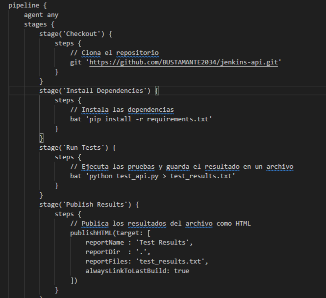
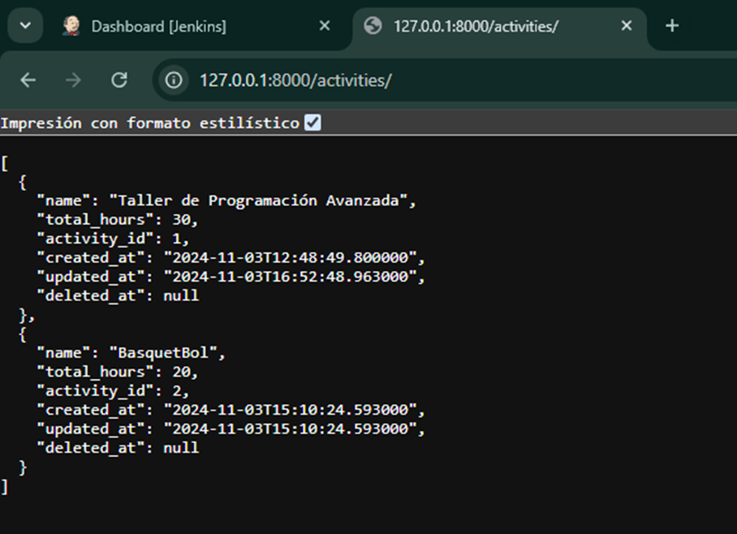
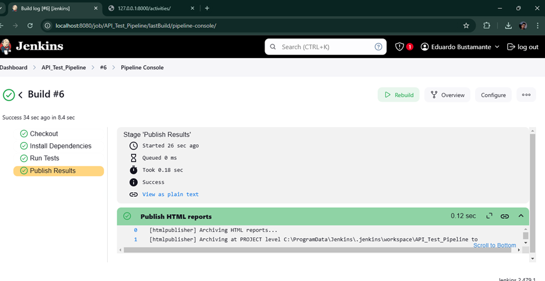
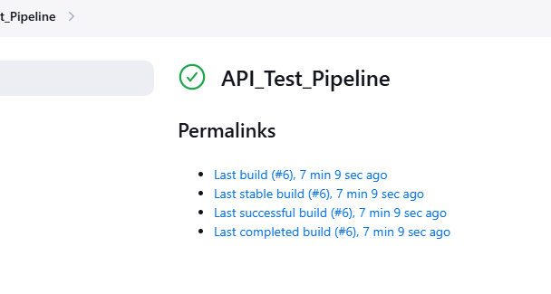
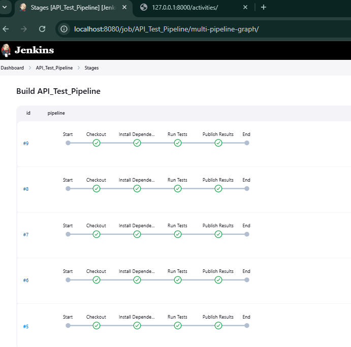
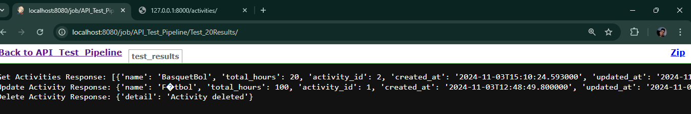
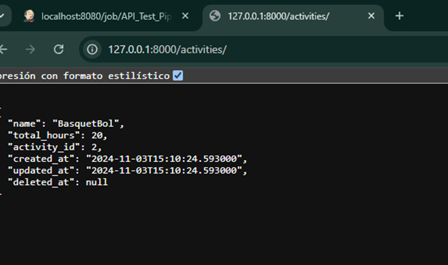

# Construir la imagen 
## docker build -t api .

# Ejecutar el Contenedor de Docker
## docker run -d -p 5000:5000 flask-api   

# Verificar que este en ejecución
## docker ps

# Crear entorno visual
## python3 -m venv .venv //linux(WSL)

# Iniciar el entorno virtual
## .venv\Scripts\Activate 

---------------------------------------------------------------------
# ruta Jenkins
## http://localhost:8080/

# Resultados de las Pruebas de la API en Jenkins

## Capturas de Pantalla de Jenkins

